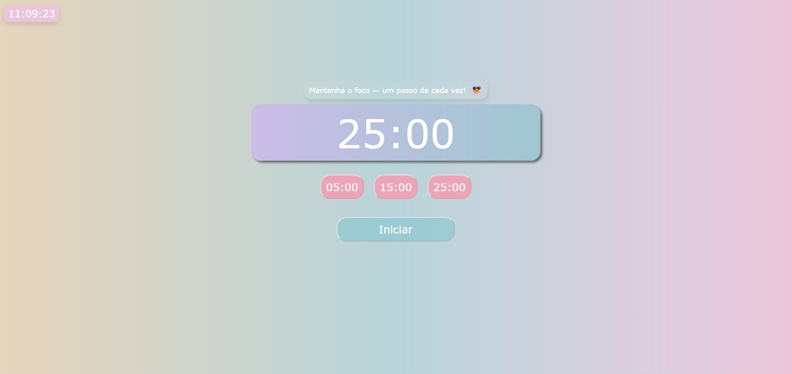

# Pomodoro Timer

Pequeno projeto em HTML/CSS/JavaScript que implementa um temporizador Pomodoro simples.

## Visão Geral
- Permite escolher durações rápidas (05:00, 15:00, 25:00).
- Botão `Iniciar` inicia a contagem regressiva e vira `Pausar` enquanto está rodando.
- Durante a contagem os botões de duração são desabilitados; quando chega em `00:00` os botões são reativados.

## Como usar
1. Abra o arquivo `index.html` no navegador (duplo-clique ou arraste-o para o navegador).
2. Clique em um dos botões de duração (`05:00`, `15:00`, `25:00`).
3. Clique em `Iniciar` para começar a contagem; o botão passa a `Pausar`.
4. Clique em `Pausar` para interromper temporariamente; clique em `Iniciar` para retomar.

## Estrutura de arquivos
- `index.html` - marcação da página e botões.
- `style.css` - estilos visuais.
- `script.js` - lógica do temporizador (seleção de duração, iniciar/pausar, formatação de tempo).

## Notas para desenvolvedores

## Licença
Este projeto está licenciado sob a Licença MIT. Veja o arquivo [LICENSE](LICENSE) para detalhes.
